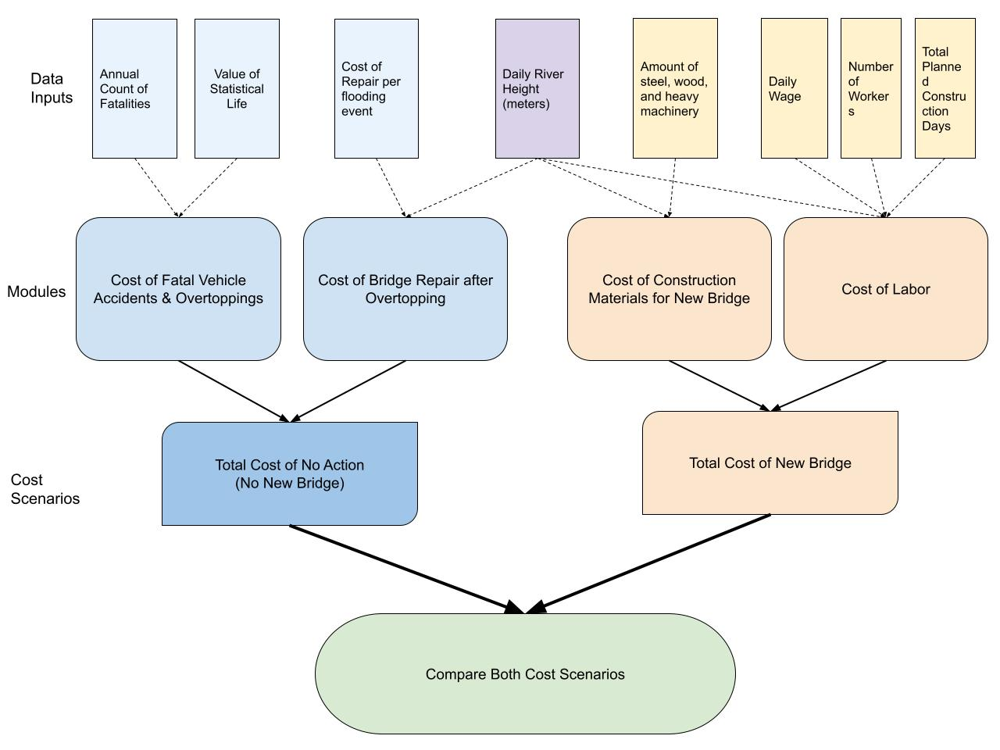

# Notes (delete this section later)
### Assignment 5

With a partner, think of an example complex data science task/program that you might want to design with:

- at least 4 modules
- at least one for (or while) loop

Planning - Step 1

- sketch a diagram that shows how these modules would be put together to go from inputs to output for the overall program (30pts)
- write a contract for the overall program (input, output, parameters) (10pts)
- break the program into modules (naming them appropriately), write a contract for each one (20pts)

Implementation - Step 2

- write functions (stored in separate documents) for each module (30pts)
- write an overall program that manages calls to each function (10pts)
- create some data and use it to test the program (10pts)

Ideas

based on amount of precipitation, calculate the height of the water (goes into both options)

costs for no action (old bridge) - accidents/fatalities - infrastructure damages as a function of precipitation - increased travel times due to rerouting when bridge closed

costs for building new bridge - construction materials - construction labor - if there's too much rain, have to stop construction and delays cost X amount (for loop)

final module - add modules of each option and print results

## Introduction
The California Department of Fish and Wildlife (CDFW) and California Department of Transportation (Caltrans) is considering the replacement of the Sandia Creek Drive crossing with a new bridge by 2027 will reconnect over twelve miles of habitat along the Santa Margarita River for endangered Southern California Steelhead trout (Oncorhynchus mykiss irideus) in northern San Diego County. The Santa Margarita river would be the first perennially-flowing river in Southern California with no anadromous fish migration barriers in its mainstem. The new bridge would also improve emergency response access and evacuation reliability, as its proposed design can withstand a 100-year storm event without overtopping with flowing water.

The agencies wish to compare costs of two options: no action (keeping the existing bridge) and constructing a new bridge. The option with the lowest cost will be chosen moving forward.

The following program uses several modules to compare cost scenarios:
```{r}

```

The following R packages are needed for this program:
```{r}
library(tidyverse)
library(here)
```

## Program Contract *(add to this section as you build each function)*

#### Inputs
`crashcount`: the number of fatalities per year due to water overtopping the bridge
`river_height_data`: data with daily precipitation amounts 


```{r}
# Example: generate river height data 

# set seed for reproducibility
set.seed(262)

# Generate 365 steps: changes are either -1, 0, or 1
changes <- sample(c(-1, 0, 1), 365, replace = TRUE)
river_ht <- 8 + cumsum(changes) # Optimal river height is 8 meters, flooding when height > 20m

print(river_ht)

river_height_data <- data.frame(
  day = seq(1,365),
  river_ht
)
```

#### Parameters

#### Output


### Option 1: No Action (Keep Existing Bridge)

#### 1.1 Calculate the cost of fatalities caused by flooding

```{r}
source(here("fatal_cost.R"))

# use function, and enter the number of annual fatalities below. 
npv <- fatal_cost(100)
print(npv)

npv_format <- format(npv, big.mark = ",", scientific = FALSE)
sprintf("The total cost of fatalities from the existing bridge is estimated to be $%s.", npv_format)
```

#### 1.2 Calculate the cost of bridge repairs caused by flooding
```{r}

```


#### Total Cost of Option 1
```{r}
#total_op1 = npv + repairs

#print(total_op1)

#sprintf("The total cost of no action is estimated at %n.", total_op1)
```


### Option 2: Construct New Bridge

#### 2.1 Calculate the cost of Materials

#### 2.2 Calculate the cost of Labor

#### Total Cost of Option 2


### Compare Option 1 vs Option 2


## Results


