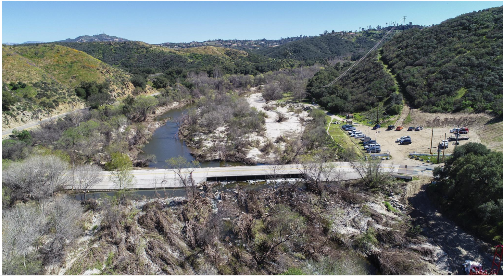

## Introduction

The California Department of Fish and Wildlife (CDFW) and California Department of Transportation (Caltrans) is considering the replacement of the Sandia Creek Drive crossing with a new bridge by 2027 will reconnect over twelve miles of habitat along the Santa Margarita River for endangered Southern California Steelhead trout (*Oncorhynchus mykiss irideus*) in northern San Diego County. The Santa Margarita river would be the first perennially-flowing river in Southern California with no anadromous fish migration barriers in its mainstem. The new bridge would also improve emergency response access and evacuation reliability, as its proposed design can withstand a 100-year storm event without overtopping with flowing water.

This program helps the agencies compare the costs of two options: (1) no action (keeping the existing bridge) and (2) constructing a new bridge. The option with the lowest cost will be chosen moving forward.

The following program uses several modules to compare cost scenarios:

```{r}
#| echo: false
knitr::include_graphics("images/flowchart.jpg")
```

The following R packages are needed for this program:

```{r}
#| message: false
#| warning: false
library(tidyverse)
library(here)
library(devtools)
library(testthat)
```

## Program Contract

#### Program Inputs

`crashcount`: the average number of fatalities per year due to the bridge flooding.

```{r}
# Example of simulated fatality data 

# set seed for reproducibility
set.seed(262)
crashcount = sample(10:30, 1, replace = TRUE)
print(crashcount)
```

`river_height_data`: data with daily precipitation amounts

```{r}
# Example of simulated river height data 

# set seed for reproducibility
set.seed(262)

# Generate 365 steps: changes are either -1, 0, or 1
changes <- sample(c(-1, 0, 1), 365, replace = TRUE)
river_ht <- 8 + cumsum(changes) # Optimal river height is 8 meters, flooding when height > 20m

print(river_ht)

river_height_data <- data.frame(
  day = seq(1,365),
  river_ht
)
```

#### Program Parameters:

**Scenario-specific parameters can be changed for the entire program here:**

```{r}
#discount rate to calculate Net Present Value (NPV)
discount = 0.07

#time period for evaluating NPV (years)
time = 30

#river height at which the bridge floods, and when construction work halts
flood_threshold = 20

# Current Value of a Statistical Life (VSL) from the U.S. Department of Transportation
vsl = 7400000

# estimated cost of repairs needed per flooding event ($USD)
costperflood = 1000000

#number of workers on site 
workers = 40

#daily wage per worker in dollars
daily_wage = 350

#total planned construction workdays
work_days = 365

```

#### Program Output:

`event_count`: The total number of flooding events per year

`total_NPV_op1`: The total NPV of option 1

`total_NPV_op2`: The total NPV of option 2

Finally, the comparison of the total costs of Option 1 vs Option 2.

## Option 1: No Action (Keep Existing Bridge)

#### 1.1 Calculate the value of fatalities caused by flooding

```{r}
source(here("R/fatal_cost.R"))

# Instructions: enter the average number of fatalities per year below into the function "fatal_cost".
# example below: 25 fatalities per year, on average
fatal_NPV <- fatal_cost(crashcount=crashcount, 
                        vsl = vsl, 
                        discount = discount,
                        time = time)
print(fatal_NPV)

fatal_npv_format <- format(fatal_NPV, big.mark = ",", scientific = FALSE)
sprintf("The cost of fatalities from the existing bridge is estimated to be $%s.", fatal_npv_format)
```

#### 1.2 Calculate the cost of bridge repairs caused by flooding

```{r}
# Step 1.2.1 Use River Height Data to determine the number of flooding events per year

# Initialize variables
event_count <- 0
in_event <- FALSE

for (i in 1:nrow(river_height_data)) {
  
  # Check if current day exceeds threshold
  if (river_height_data$river_ht[i] > 20) {
    
    # If we are not already in an event, start a new one
    if (!in_event) {
      event_count <- event_count + 1
      in_event <- TRUE
    }
    
  } else {
    # If height drops below threshold, reset the in_event flag
    in_event <- FALSE
  }
}

print(paste("Estimate of Total flood events per year:", event_count))


# Step 1.2.2 Use total flood events to calculate the total NPV of all future flooding events. 
source(here("R/bridge_repair_cost.R"))

bridge_repair_NPV <- bridge_repair_cost(floods = event_count, 
                                        costperflood = costperflood, 
                                        discount = discount, 
                                        time = time)

repair_npv_format <- format(bridge_repair_NPV, big.mark = ",", scientific = FALSE)
sprintf("The cost of repairing the existing bridge is estimated to be $%s.", repair_npv_format)
```

#### Total Cost of Option 1

```{r}
total_NPV_op1 = fatal_NPV + bridge_repair_NPV

sprintf("The total cost of no action is estimated at $%s.", total_NPV_op1)
```

## Option 2: Construct New Bridge

#### 2.1 Calculate the cost of Materials

```{r}
#load all modules
source(here("R/repair_cost.R"))        #depends on count_flood_days
source(here("R/material_cost.R"))      #depends on count_flood_days
source(here("R/labor_cost.R"))         #depends on count_flood_days
source(here("R/compare_costs.R"))
```

Inputs: river height data Outputs: total material costs in \$ for flood delays

```{r}
# Module 2.1

materials <- material_cost(river_height_data,
                           flood_threshold = flood_threshold)

#update for assignment 6
#example use of material_cost
example_data <- data.frame(
  day = 1:10,
  river_ht = c(25, 25, 25, 5, 5, 5, 5, 5, 5, 5)
)

material_cost(example_data, base_material_cost = 2000000, 
              flood_threshold = 20, cost_per_day = 10000)
```

#### 2.2 Calculate the cost of Labor

Input: river height data Output: total labor cost in dollars accounting for flood

```{r}
# Module 2.2

labor <- labor_cost(river_height_data,
                    flood_threshold = flood_threshold) 
```

#### Total Cost of Option 2

```{r}
# Total Option 2
total_NPV_op2 <- materials + labor  # keep as NUMBER, don't format yet

sprintf("The total cost of constructing a new bridge is estimated at $%s.",
        format(round(total_NPV_op2), big.mark = ","))

```

## Compare Option 1 vs Option 2

```{r}
#compare_costs()
result <- compare_costs(total_NPV_op1, total_NPV_op2)

cat("=== Bridge Cost Comparison ===\n")
cat(sprintf("Option 1 (No Action):  $%s\n",
            format(round(result$option1_cost), big.mark = ",")))
cat(sprintf("Option 2 (New Bridge): $%s\n",
            format(round(result$option2_cost), big.mark = ",")))
cat(sprintf("Recommendation: %s. This will save $%s.\n",
            result$recommendation,
            format(round(result$savings), big.mark = ",")))
```

## Results

Based on the data provided, building a new bridge incurs approximately \$16,762,355 less in costs over thirty years than no action.

```{r}
#| echo: false

```
